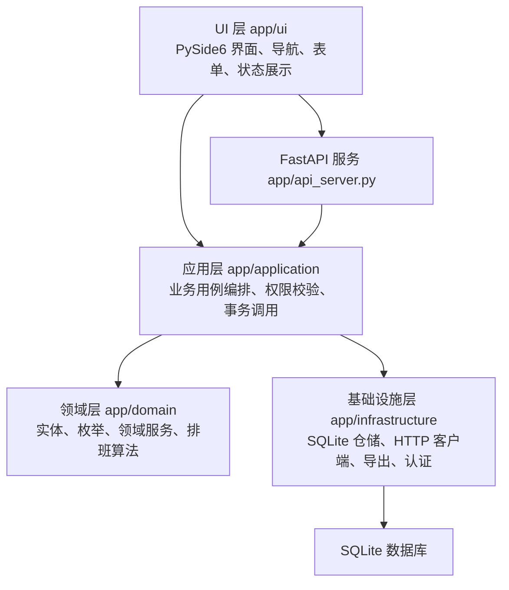

# 校园先到先得报名与智能排班系统项目报告

## 一、项目概述

本项目是一个面向校园活动管理场景的桌面应用系统，主要解决志愿服务、课堂展示、选题选课、社团活动等场景中常见的报名统计、名额控制、自动排班和签到管理问题。传统处理方式通常依赖微信群接龙、问卷表单或 Excel 人工汇总，容易出现超额报名、重复报名、统计滞后、调剂效率低和权限边界不清晰等问题。

系统以 Python 和 PySide6 为主要技术栈，实现了 Qt 原生桌面端界面；以 SQLite 作为本地数据存储；同时提供 FastAPI 后端服务，使系统既可以单机本地运行，也可以切换为远程服务模式。项目围绕“活动创建、报名、排班、签到、通知、导出”形成完整业务闭环，能够较好地适配校园组织者和普通参与者的日常使用需求。

## 二、项目目标

本项目的建设目标主要包括以下几个方面：

1. 实现校园活动从创建、发布、报名、排班到签到的全流程管理。
2. 支持先到先得报名和盲报排班两类核心报名模式，减少人工协调成本。
3. 通过 SQLite 事务机制控制名额锁定，避免并发或重复操作导致超额报名。
4. 提供超级管理员、活动组织者、普通用户三类角色，实现基本 RBAC 权限管理。
5. 支持本地桌面运行和远程 API 运行两种模式，提高系统部署灵活性。
6. 使用分层架构组织代码，使界面、业务逻辑、领域模型和数据访问职责清晰。

## 三、需求分析

### 3.1 用户角色

系统设计了三类用户角色：

| 角色 | 主要权限 |
| --- | --- |
| 超级管理员 | 管理所有用户和活动，审批用户，发布、关闭、归档活动，执行排班和签到管理 |
| 活动组织者 | 创建和管理自己负责的活动，配置报名选项，查看报名与排班结果 |
| 普通用户 | 浏览开放活动，提交报名，查看排班结果，进行签到和查看个人日程 |

这种角色划分符合校园场景中“平台管理员、活动负责人、活动参与者”的实际组织结构。

### 3.2 核心功能需求

系统的核心功能包括：

1. 用户管理：支持注册、登录、用户审批、角色区分、头像和通知偏好设置。
2. 活动管理：支持活动创建、编辑、复制、提交审核、发布、关闭、归档等生命周期操作。
3. 报名选项管理：既支持传统时间段，也支持选题、课程、座位、自定义选项等非时段模式。
4. 报名管理：支持实时名额锁定、盲报、多志愿优先级、意愿点分配和兼报模式。
5. 智能排班：支持贪心、先到先得、抽签、意愿点等分配策略。
6. 签到管理：支持人工签到、自助码签到、位置签到、照片签到等模式。
7. 小组管理：支持创建小组、成员审批、限定小组成员报名。
8. 通知与导出：支持报名成功、排班结果等系统通知，并可导出 Excel 报表。

## 四、技术选型

| 模块 | 技术 |
| --- | --- |
| 桌面客户端 | Python、PySide6、Qt Widgets |
| 后端服务 | FastAPI、Uvicorn |
| 数据存储 | SQLite |
| HTTP 通信 | requests |
| 数据导出 | pandas、openpyxl |
| 密码处理 | passlib |
| 测试框架 | pytest、unittest |
| 打包工具 | PyInstaller |

PySide6 用于构建原生桌面交互界面，适合课程项目中对 Qt 桌面应用的要求。SQLite 轻量、免部署，适合本地运行和课程演示。FastAPI 则为系统提供了可选的远程访问能力，使客户端可以通过 HTTP API 与服务端通信。

## 五、系统架构设计

项目采用接近领域驱动设计的分层结构，代码主要分为 UI 层、应用服务层、领域层和基础设施层。



### 5.1 本地模式

在本地模式下，桌面客户端直接初始化 SQLite 数据库，并通过本地 Repository 和 Service 完成业务操作。该模式部署简单，适合单机演示、小规模活动管理和课程验收。

### 5.2 远程模式

在远程模式下，桌面客户端通过 `ApiClient` 调用 FastAPI 服务端接口。服务端负责认证、权限判断、业务处理和数据库访问。该模式更接近真实的客户端/服务端结构，便于多人在局域网内共享同一套数据。

## 六、核心模块设计与实现

### 6.1 用户与权限模块

用户实体包含用户名、角色、状态、头像路径、通知偏好等信息。系统使用 `Role` 枚举区分超级管理员、组织者和普通用户，使用 `UserStatus` 管理待审核、已通过和已拒绝状态。应用层通过 `UserService` 实现注册、登录、审批和权限判断。

密码使用 `passlib` 进行哈希处理，避免明文存储。远程模式下，FastAPI 服务端使用 Bearer Token 进行接口认证，并设置 token 过期清理逻辑。

### 6.2 活动生命周期模块

活动实体包含活动名称、创建者、报名时间、活动详情、报名模式、排班模式、签到模式、活动类型等字段。活动状态包括：

| 状态 | 含义 |
| --- | --- |
| DRAFT | 草稿 |
| PENDING_REVIEW | 待审核 |
| OPEN | 报名开放 |
| CLOSED | 报名关闭 |
| ARCHIVED | 已归档 |

活动创建后先进入草稿状态，经过提交审核和发布后进入开放状态。报名结束后可关闭活动并执行排班，最终归档保存历史记录。这种状态机设计使活动流程清晰，减少非法操作。

### 6.3 报名与名额锁定模块

报名模块支持两种主要模式：

1. 实时报名：用户提交报名后立即尝试锁定名额，适合先到先得场景。
2. 盲报模式：用户先提交志愿，报名结束后统一排班，适合抽签或调剂场景。

在实时报名中，系统通过 SQLite 的事务能力进行名额锁定。`lock_slot` 会在事务中检查容量并更新 `used_count`，如果名额不足则拒绝报名，从而避免超额报名。用户取消实时模式报名时，系统会释放对应名额。

系统还支持优先级报名、意愿点模式和兼报模式。意愿点模式中，用户可为不同志愿分配点数，总点数上限为 99，排班时点数更高的志愿优先，同点数之间随机处理。

### 6.4 智能排班模块

核心排班算法位于领域服务 `schedule_registrations()` 中。它接收报名记录和报名选项，根据活动配置选择不同分配策略：

| 排班模式 | 策略 |
| --- | --- |
| GREEDY | 按志愿优先级和报名时间排序 |
| FIRST_COME | 按报名创建时间排序 |
| LOTTERY | 随机打乱后分配 |
| POINTS | 按意愿点降序，同分随机 |

算法先尝试按照用户原始选择的报名选项进行分配；在单报模式下，如果原选项满额，会尝试调剂到同活动下仍有余量的其他选项。为了避免调剂后状态误判，算法返回值中保留了原报名记录 ID，使应用层可以准确更新 `ASSIGNED` 或 `NOT_ASSIGNED` 状态。

排班执行过程由 `SchedulingService` 统一编排，并在单个事务中完成重置旧结果、读取报名、计算分配、写入排班结果、更新名额统计和更新报名状态等操作，保证排班结果一致。

### 6.5 签到模块

签到模块支持人工签到、自助签到码、位置签到和照片签到。活动可以设置签到开始和结束时间，也可以由管理员手动提前关闭或重新开放签到。签到结果记录用户、活动、报名选项、签到状态、签到时间以及位置或照片信息，便于后续统计。

对于非时段类活动，系统在活动创建阶段限制不合理的签到模式，例如选题类活动不支持位置签到，从业务规则层面避免脏数据。

### 6.6 小组与通知模块

小组模块用于处理限定范围活动，例如只允许某个班级、社团或项目组成员报名。组织者可以创建小组，成员加入后经过审批成为正式成员。活动可绑定小组 ID，报名时系统会检查用户是否属于对应小组。

通知模块用于记录报名成功、排班结果等消息。系统通知不会影响主业务流程，即使通知保存失败，也不会回滚报名或排班操作，从而提高核心业务稳定性。

## 七、数据库设计

系统使用 SQLite 保存核心数据。主要数据表包括：

| 表名 | 作用 |
| --- | --- |
| users | 保存用户账号、角色、状态、密码哈希等信息 |
| activities | 保存活动基础信息、状态、报名模式、排班模式和签到配置 |
| slots | 保存时段、选题、课程、岗位等报名选项及容量 |
| registrations | 保存用户报名记录、志愿优先级、状态和意愿点 |
| schedule_results | 保存最终排班结果 |
| checkins | 保存签到记录 |
| groups / group_members | 保存小组和成员关系 |
| notifications | 保存系统通知 |

数据库访问统一封装在仓储层中，UI 不直接访问数据库。这样做的优点是上层业务不依赖具体数据库实现，后续若从 SQLite 切换到 PostgreSQL，也可以优先保持 Service 接口不变。

## 八、API 设计

远程模式下，FastAPI 服务端提供 REST 风格接口。接口主要分为以下几类：

1. 认证接口：登录、注册、获取当前用户。
2. 用户接口：用户列表、待审批用户、审批、拒绝、删除和个人设置。
3. 活动接口：活动列表、创建、编辑、复制、删除、状态变更。
4. 报名选项接口：时段、岗位、课程、选题等选项管理。
5. 报名接口：创建报名、取消报名、查看报名记录。
6. 排班接口：执行排班、查看排班结果。
7. 签到接口：人工签到、自助码签到、位置签到、照片签到、签到统计。
8. 统计接口：总览指标、用户个人指标和时段数量统计。

服务端使用统一的异常转换逻辑，将领域层中的权限错误、冲突错误、容量不足和校验错误转换为对应 HTTP 状态码，提升前后端交互的一致性。

## 九、界面设计

系统界面采用 PySide6 Qt Widgets 实现，并按角色展示不同窗口。

管理员和组织者进入管理端，主要包含概览、活动管理、排班管理、签到管理、用户管理等页面。普通用户进入客户端，主要包含概览、报名、我的结果、签到和日程表等页面。

项目还实现了主题和密度系统，支持浅色/深色主题与紧凑/舒适布局切换。界面风格通过 `style.py` 和 `theme.py` 统一生成 QSS，降低了各页面重复样式代码。

## 十、测试与质量保障

项目包含多组测试文件，覆盖数据库、领域逻辑、场景流程、排班面板和报名面板等内容。典型测试包括：

1. 领域算法测试：验证不同排班模式下的分配结果。
2. 数据库测试：验证仓储读写、名额锁定和释放。
3. 端到端场景测试：模拟管理员创建活动、用户报名、关闭活动、执行排班、生成通知和导出 Excel。
4. 取消报名与签到测试：验证取消报名后状态更新和签到记录保存。

测试中通过临时 SQLite 数据库隔离不同用例，避免测试间数据污染。运行方式为：

```bash
python -m pytest tests/
```

## 十一、运行与部署

本地桌面端运行命令：

```bash
python -m app.main
```

远程 API 服务运行命令：

```bash
uvicorn app.api_server:app --reload
```

项目还提供了 Windows 批处理脚本和启动脚本，用于简化客户端、服务端运行和 PyInstaller 打包流程。默认管理员账号会在初始化时自动创建，用户名和密码均为 `admin`，便于首次登录和演示。

## 十二、项目特色

本项目的主要特色如下：

1. 业务场景真实：围绕校园活动报名、排班和签到，具有明确实际需求。
2. 架构边界清晰：UI、应用服务、领域模型、基础设施层职责明确。
3. 支持双运行模式：既能单机运行，也能通过 FastAPI 提供远程服务。
4. 名额控制可靠：使用事务实现原子锁定，降低超报风险。
5. 排班策略丰富：支持优先级、先到先得、抽签和意愿点等多种算法。
6. 扩展能力较好：报名选项抽象为通用模型，可覆盖时段、选题、课程、岗位等不同场景。
7. 测试覆盖核心流程：通过单元测试和场景测试保障主要业务链路可用。

## 十三、不足与改进方向

当前系统仍有一些可以继续完善的方向：

1. 远程模式下小组功能尚未完全支持，可以进一步补齐 API 和远程仓储实现。
2. 当前数据库使用 SQLite，适合单机和小规模使用；若部署到多人生产环境，可升级为 PostgreSQL。
3. 令牌认证采用内存存储，服务重启后会失效，后续可使用数据库或 Redis 管理会话。
4. 排班算法仍偏规则驱动，后续可以加入更多约束，例如时间冲突、用户偏好权重和公平性指标。
5. 通知目前以应用内记录为主，可进一步扩展邮件、企业微信或校园统一消息平台。
6. 界面自动化测试可以继续增强，提升跨平台稳定性。

## 十四、总结

校园先到先得报名与智能排班系统以校园活动管理为切入点，实现了从用户登录、活动创建、报名锁额、自动排班、签到管理到结果导出的完整闭环。项目采用 PySide6 构建 Qt 桌面端，结合 SQLite、FastAPI 和分层架构设计，在保证课程项目可运行、可展示的同时，也具备一定真实应用价值。

从软件工程角度看，项目较好地体现了面向对象建模、角色权限控制、状态管理、事务处理、领域服务和分层设计等思想。它不仅解决了传统校园活动管理中人工统计效率低、名额冲突和调剂困难的问题，也为后续扩展为局域网多人协作系统或正式活动管理平台打下了基础。
